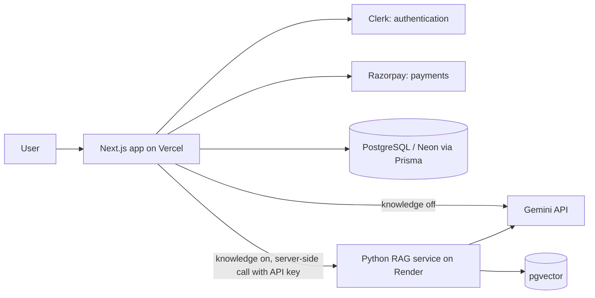

# 🚀 AI Content Generator

An AI content generation platform with **18 reusable writing tools** (blogs, YouTube, Instagram, writing help, code, marketing) built on **Next.js and Google Gemini**. Its standout feature is a **Brand Knowledge Base**: users upload their own documents, and the AI writes using their real facts and tone, showing which sources it used.

🔗 **Live demo:** https://YOUR-APP.vercel.app
🧠 **RAG service (Python):** https://github.com/YOUR-USERNAME/rag-service


## ✨ Features

* 🧠 **Brand Knowledge Base (RAG):** upload PDF, TXT, Markdown, pasted text or a website URL, then switch on "Use my brand knowledge" in any tool
* 🔀 **Two modes per tool:** quick general output, or personalized output grounded in the user's own documents
* 📚 **Source display:** see which documents were used for each generation, with citations in Blog Content
* 🧩 **18 template-driven AI tools** across Blog, YouTube, Instagram, Writing, Code and Marketing
* 🔐 Authentication with Clerk
* 🎟️ Credit-based usage (10 free generations, unlimited on Pro), **enforced on the server**
* 💳 Subscriptions and payments with Razorpay
* 📝 Rich-text output editor and full generation history
* 🗄️ PostgreSQL (Neon) with Prisma
* 🌍 Deployed on Vercel

## 📸 Screenshots

| Knowledge Base | Generation with sources |
|---|---|
|  |  |

## 🛠️ Tech Stack

| Layer          | Technology                                   |
| -------------- | -------------------------------------------- |
| Frontend       | Next.js 15 (App Router), React, Tailwind CSS, Framer Motion |
| Backend        | Next.js API Routes                           |
| AI             | Google Gemini API                            |
| RAG service    | Python, FastAPI, pgvector (separate repo)    |
| Authentication | Clerk                                        |
| Payments       | Razorpay                                     |
| Database       | PostgreSQL (Neon), Prisma                    |
| Deployment     | Vercel (app), Render (RAG service)           |

## 🏗️ Architecture



The app uses a **template-driven architecture**: each AI tool defines its own `slug`, `aiPrompt` and form fields, so new tools can be added without creating new pages or components.

## 🔄 How a generation works

```text
Template → Dynamic form → formData
   │
   ▼
POST /api/ai   (Clerk session check → credit check → mode check)
   │
   ├── "Use my brand knowledge" OFF → Gemini → response
   │
   └── ON → Python RAG service
              ├─ search the user's own documents (per-user filter)
              ├─ build a prompt with the relevant excerpts
              └─ Gemini → response + sources
                          (falls back to plain Gemini if the service is unavailable)
   │
   ▼
Output editor + "Sources used" panel → saved to history
```

## 🔒 Security and reliability

* The user ID sent to the RAG service always comes from the **Clerk session on the server**, never from the browser
* Knowledge is searched only within the signed-in user's own documents
* The RAG service is protected by a shared secret (`x-api-key`) and is only called from the Next.js backend
* **Credit limits are enforced server-side** on `/api/ai`, not just in the UI
* If the RAG service is down or asleep, generation **falls back to normal Gemini** instead of failing

## 📁 API routes

| Route | Purpose |
| --- | --- |
| `POST /api/ai` | Generate content (auth, credit check, optional knowledge base) |
| `GET/POST /api/ai-output` | Save and list generation history |
| `GET/POST /api/knowledge` | List documents, add a file, text or URL |
| `DELETE /api/knowledge/[id]` | Delete a document |
| `GET /api/user` | Current user and plan |

## ⚙️ Getting started

**Prerequisites:** Node.js 20+, a PostgreSQL database, and the [RAG service](https://github.com/YOUR-USERNAME/rag-service) running or deployed.

```bash
git clone https://github.com/YOUR-USERNAME/ai-content-generation.git
cd ai-content-generation
npm install
npx prisma generate
npx prisma migrate dev
npm run dev
```

Create a `.env` file:

```env
# Clerk
NEXT_PUBLIC_CLERK_PUBLISHABLE_KEY=
CLERK_SECRET_KEY=
NEXT_PUBLIC_CLERK_SIGN_IN_URL=/sign-in
NEXT_PUBLIC_CLERK_SIGN_UP_URL=/sign-up

# AI
GEMINI_API_KEY=

# Database
DATABASE_URL=

# Razorpay
RAZORPAY_ID=
RAZORPAY_SECRET=
NEXT_PUBLIC_RAZORPAY_KEY_ID=
SUBSCRIPTION_PLAN_ID=

# RAG service
RAG_SERVICE_URL=https://your-rag-service.onrender.com
RAG_API_KEY=
```

Open http://localhost:3000.

## 🧪 Try the Brand Knowledge Base

1. Sign up and open **Knowledge** in the sidebar
2. Paste a few lines about a business (products, prices, tone of voice)
3. Open any tool, such as Instagram Post, and keep **Use my brand knowledge** on
4. Generate, then switch it off and generate again to compare

## 🗺️ Roadmap

* Hybrid search (keyword plus semantic)
* Retrieval evaluation script
* Rate limiting on the RAG service
* Reading text from scanned PDFs and images

## 📄 License

MIT
